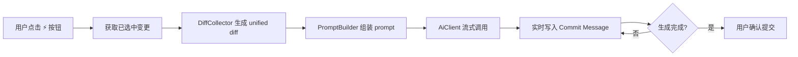

# AI Commit Message

<p align="center">
  <strong>基于 AI 的 JetBrains Git Commit Message 自动生成插件</strong>
</p>

---

## ✨ 功能特性

- **一键生成** — 在 Commit 对话框工具栏中点击闪电按钮，基于已选中的文件变更自动生成 commit message
- **流式输出** — 实时显示生成过程，无需等待完整响应
- **多 AI 提供商** — 支持 OpenAI、Anthropic、Gemini 及任意 OpenAI 兼容端点
- **提示词模板** — 内置 Conventional Commits / Simple / Detailed 三套模板，支持自定义
- **代理支持** — 跟随 IDE 全局代理或独立配置自定义代理
- **安全存储** — API Key 通过 IntelliJ PasswordSafe 加密存储，不明文落盘
- **可中断** — 生成过程中再次点击即可取消

## 📸 效果预览

在 Commit 对话框中，AI 生成按钮出现在 commit message 编辑器上方工具栏：

```
┌─ Commit Changes ─────────────────────────────────────┐
│                                                       │
│  ⚡ Generate AI Commit Message    Amend  History      │
│  ┌──────────────────────────────────────────────────┐ │
│  │ feat(ui): add streaming commit message generator │ │
│  │                                                  │ │
│  │ Implement real-time token-by-token output using  │ │
│  │ SSE, with cancellation support...                │ │
│  └──────────────────────────────────────────────────┘ │
│                                                       │
│  ☑ src/main/kotlin/.../GenerateCommitMessageAction.kt │
│  ☑ src/main/kotlin/.../AiClient.kt                    │
│  ☑ src/main/kotlin/.../Settings.kt                    │
└───────────────────────────────────────────────────────┘
```

## 🔧 环境要求

| 依赖 | 版本 |
|------|------|
| IntelliJ IDEA | 2024.3+ (Community / Ultimate) |
| JDK | 21 |
| Gradle | 8.12 |
| Kotlin | 2.1.0 |

## 🚀 安装

### 方式一：从源码构建

```bash
# 克隆项目
git clone https://github.com/fangzc/ai-commit-message.git
cd ai-commit-message

# 构建插件
./gradlew build

# 产物位于
# build/libs/ai-commit-message-1.0.0-base.jar
```

在 IntelliJ IDEA 中安装：`Settings → Plugins → ⚙️ → Install Plugin from Disk...` → 选择构建产物。

### 方式二：开发调试

```bash
./gradlew runIde
```

启动一个包含插件的调试 IDE 实例。

## ⚙️ 配置

`Settings → Tools → AI Commit Message`

### AI Provider 配置

| Provider | 默认 API 地址 | 默认模型 |
|----------|-------------|---------|
| OpenAI | `https://api.openai.com` | gpt-4o-mini, gpt-4o, gpt-4.1-mini, gpt-4.1-nano, o4-mini |
| Anthropic | `https://api.anthropic.com` | claude-sonnet-4-20250514, claude-haiku-4-20250414 |
| Gemini | `https://generativelanguage.googleapis.com` | gemini-2.5-flash, gemini-2.0-flash, gemini-2.5-pro |
| Custom | 用户自定义 | 用户自定义 |

### 提示词模板

**Conventional Commits**（默认）：
```
<type>(<scope>): <subject>

<body>
```

**Simple**：
```
<type>(<scope>): <subject>
```

**Detailed**：
```
<type>(<scope>): <subject>

<body>

<footer>
```

**自定义模板**支持 `{diff}` 和 `{locale}` 占位符。

### 代理配置

- **IDE Proxy** — 跟随 IDE 全局代理设置（默认）
- **Custom Proxy** — 独立配置 Host / Port / 认证信息
- **No Proxy** — 不使用代理

### 高级配置

| 参数 | 默认值 | 说明 |
|------|-------|------|
| Max Diff Length | 10000 | 发送给 AI 的 diff 最大字符数 |
| Temperature | 0.7 | 生成随机性 |
| Max Tokens | 1024 | 最大生成 token 数 |
| Locale | en | 生成语言 |

## 🏗️ 项目结构

```
src/main/kotlin/com/github/fangzc/aicommit/
├── action/
│   └── GenerateCommitMessageAction.kt   # 主按钮 Action
├── ai/
│   ├── AiClient.kt                      # 统一客户端接口
│   ├── AbstractAiClient.kt              # 基类（OkHttp + SSE）
│   ├── AiClientFactory.kt               # 工厂
│   ├── AiProvider.kt                    # 提供商枚举
│   └── impl/
│       ├── OpenAiClient.kt              # OpenAI 实现
│       ├── AnthropicClient.kt           # Anthropic 实现
│       ├── GeminiClient.kt              # Gemini 实现
│       └── CustomClient.kt              # OpenAI 兼容端点
├── diff/
│   └── DiffCollector.kt                 # Diff 收集器
├── prompt/
│   ├── PromptBuilder.kt                 # 提示词构建
│   └── DefaultPrompts.kt               # 内置提示词模板
├── settings/
│   ├── PluginSettings.kt                # 配置持久化
│   └── PluginSettingsConfigurable.kt    # Settings UI
└── util/
    └── ProxyConfigUtil.kt              # 代理配置工具
```

## 🔀 核心流程



## 🛠️ 技术栈

- **Kotlin 2.1.0** + JVM Toolchain 21
- **IntelliJ Platform Plugin SDK** 2.2.1
- **kotlinx-serialization-json** 1.7.3
- **OkHttp** — HTTP 客户端 + SSE 流式解析
- **Git4Idea** — Git 集成
- **Coroutine** — 异步并发与取消

## 📜 License

MIT License
